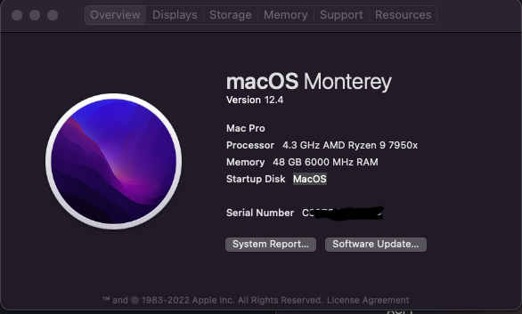

# 7950x rx6600xt hackintosh

## Hardwords

- Motherboard: colorful CVN B650 Gaming Frozen V14
- NetworkCard: RTL8125 2.5Gbit
- Wireless: Intel AX200 WiFi 6, Bluetooth5.1
- SoundCard: Realtek ALC897
- CPU: amd 7950x
- GPU: amd rx6600xt

## Working

- Wifi working fine
- Ethernet working fine
- GPU working fine
- Buletooh (not stable)

## Problem

- Sleep wake-up freeze
- Airdrop not working
- Black Screen when boot
- ALC897 not working (using usb soundbar instead)

## System overview

